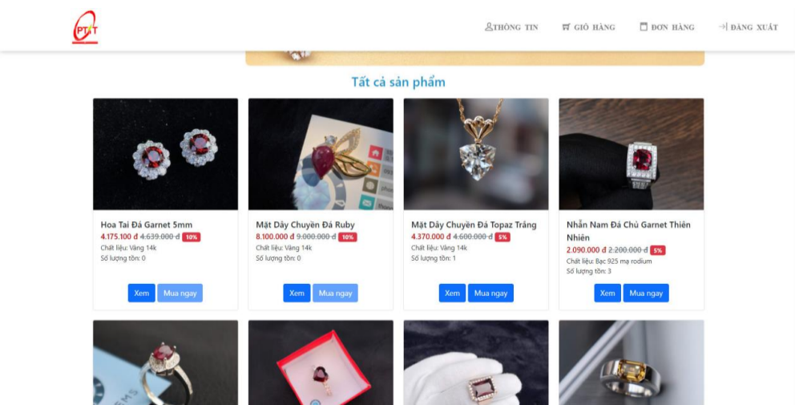
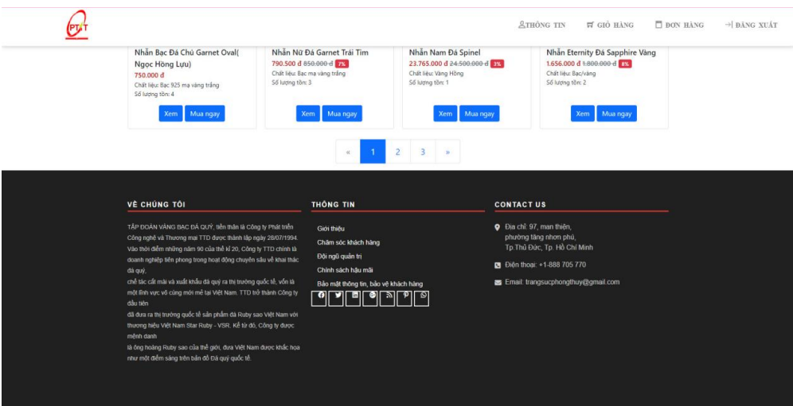
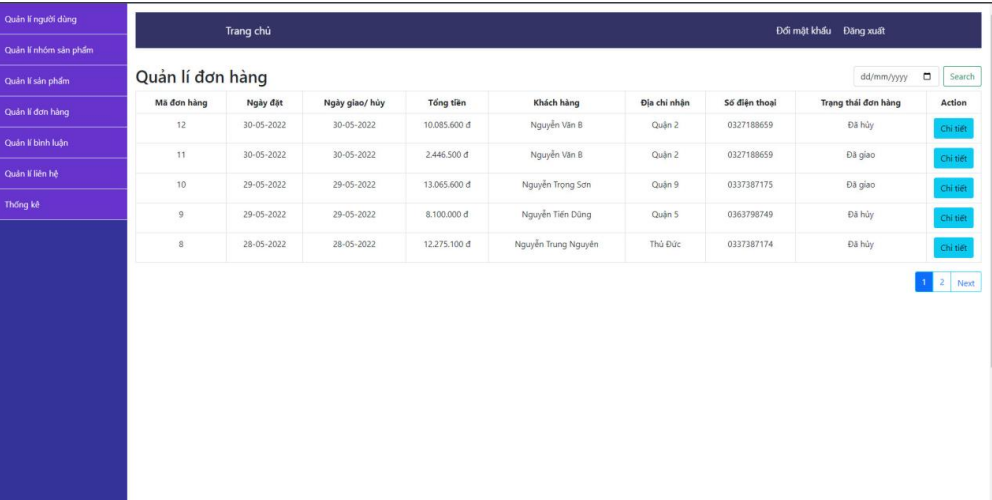

## Web đề tài bán trang sức
- Sử dụng ngôn ngữ Java JDK17, Bootstrap 4 , Spring MVC 4.0.1 , Tomcat v9.0 , SQL Server 2014
## Sinh viên thực hiện
- Nguyễn Lam Trường – N19DCCN218
- Nguyễn Trọng Sơn – N19DCCN161
- Nguyễn Văn Kiên – N19DCCN077
- Thẩm Ngọc Ánh – N19DCCN012
- Nguyễn Trung Nguyên – N19DCCN124
## Người dùng
- Đăng nhập , đăng ký , quên mật khẩu (Nhận mã xác thực qua email , nhập mã Capcha)
- Thay đổi thông tin cá nhân
- Xem đơn hàng đã đặt và hủy đơn hàng ở trạng thái chưa xác nhận
- Xem sản phẩm , xem sản phẩm theo danh mục , tìm kiếm theo tên sản phẩm
- Lưu sản phẩm vào giỏ hàng - mua hàng
- Bình luận sản phẩm
- Liên hệ quản trị viên
## Quản trị viên
- Khóa tài khoản người dùng
- Thêm, xóa, sửa sản phẩm , danh mục
- Xác nhận, hủy đơn hàng
- Phản hồi bình luận
- Phản hồi liên hệ của người dùng (qua email)
- xem doanh thu theo từng tháng , từng năm
## Một số hình ảnh

